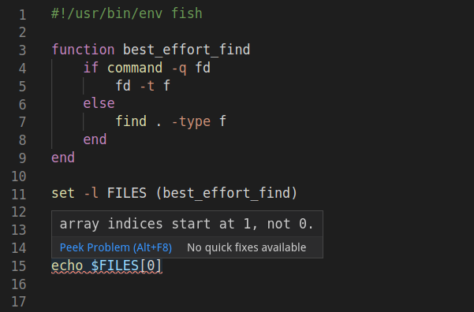

# VSCode Fish

Add syntax highlighting, linting, code formatting and snippets for the fish shell!

## Syntax Highlighting

## Completion

Non-context aware completion for keywords,
builtins and functions. Custom user functions are not shown
in completion results.

## Code Linting

Code linting uses `fish -n`.

## Code Formatting

Code formatting uses fish's `fish_indent` command.

## Snippets

Tab-complete common language constructs.

This started out as a combination of two excellent but inactive extension:
[fish-vscode](https://marketplace.visualstudio.com/items?itemName=skyapps.fish-vscode)
and
[fish-ide](https://marketplace.visualstudio.com/items?itemName=lunaryorn.fish-ide).

## Keybindings

`Ctrl+Shift+I` / `Cmd+Option+F`: Fix indentation in fish file

## Related Projects

- The [fish shell](https://fishshell.com) itself
- [fish-vscode](https://marketplace.visualstudio.com/items?itemName=skyapps.fish-vscode)
- [fish-ide](https://marketplace.visualstudio.com/items?itemName=skyapps.fish-vscode)
- [Fish shell](https://marketplace.visualstudio.com/items?itemName=gio00.fish)
